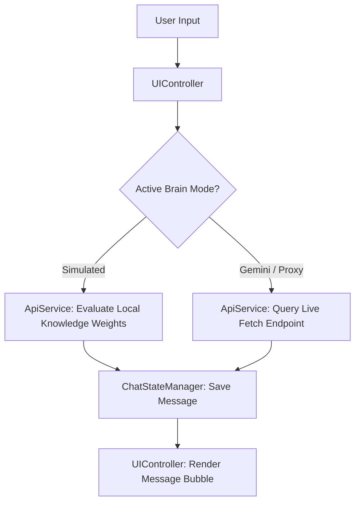

# 🧠 EgiAI — Second Brain

EgiAI is an autonomous digital partner and personal "Second Brain" built entirely from scratch with **pure vanilla HTML5, CSS3, and JavaScript (ES6+)**. No external frameworks, heavy bundlers, or third-party libraries.

It serves as both a portfolio showcase and an active productivity workspace designed for **Endri "Egi" Emini**.

---

## 🚀 Key Features

* **⚡ Three Brain Modes**:
  * **Simulated Local Brain**: A zero-latency local intelligence mode that matches user query intents against a custom-weighted knowledge base indexing Egi's portfolio projects, hardware setup, coding philosophy, and lifestyle context.
  * **Google Gemini 2.0 Flash**: Direct, official integration using your API key from Google AI Studio.
  * **Free LLM Proxy**: Connects to OpenAI/Gemini compatible API proxies using a token.
* **💾 LocalStorage Chat History Persistence**: Auto-saves conversations, recent threads, and configuration states locally in the browser so workspace data is never lost.
* **📱 Responsive Cyberpunk Glassmorphism UI**:
  * Curated dark theme using custom HSL colors and violet-cyan neon accents.
  * Sleek floating sidebars and backdrop blur properties (`backdrop-filter: blur(8px)`).
  * Responsive, screen-locked flex containers with precise wrapping calculations to eliminate horizontal overflows on all mobile viewports.
* **📝 Rich Message Formatting**: Custom in-house parser that transforms Markdown syntax (code blocks, inline code, lists, bold text, newlines) into clean, semantic HTML on-the-fly.

---

## 🛠️ Technology Stack

* **Frontend Engine:** Vanilla ES6 JavaScript (Object Literal Module Pattern)
* **Styling System:** Vanilla CSS Custom Variables (Design Tokens)
* **API Integration:** Native Fetch API with asynchronous state streams
* **Deployment:** Hosted directly on **GitHub Pages**

---

## 📁 Architecture & File Structure

The frontend application splits its logic into three dedicated modules to maintain a clean separation of concerns:

```
egi-ai/
├── index.html          — Cyberpunk DOM layouts, modals, and templates
├── style.css           — Theme variables, glassmorphism layouts, and mobile queries
└── app.js              — Core logic structured into:
    ├── ApiService      — Evaluates local knowledge weights & hits AI endpoints
    ├── ChatStateManager— Manages localStorage saves, chat histories & active threads
    └── UIController    — Binds DOM events, handles settings, and controls formatting
```

### Dynamic Content Flow:


---

## ⚙️ Setup & Customization

### Local Execution:
No installation, compilations, or dependency steps required. Simply serve the workspace or double-click to run:
1. Open the project root.
2. Serve via a lightweight HTTP server (e.g., `npx serve` or Live Server extension).
3. Open `http://localhost:3000` or the served directory port.

### Adding Custom Knowledge Base Entries:
Open [app.js](app.js) and append entries to the `KNOWLEDGE_BASE` array inside the `ApiService` block:
```javascript
{
    keywords: ['your', 'keywords', 'here'],
    response: "Your custom simulated bot response.",
    weight: 5 // Higher weight wins priority conflicts
}
```

---

## 🚀 Live Demo
Visit the live, deployed chatbot workspace at: **[egiem.github.io/egi-ai/](https://egiem.github.io/egi-ai/)**
